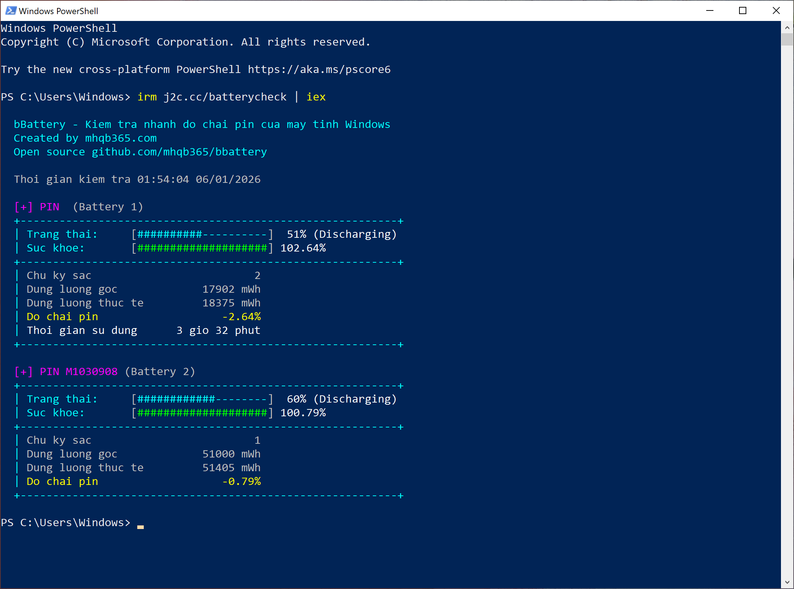

# Kiểm tra nhanh độ chai pin của máy tính Windows 🔋

Script này sử dụng công cụ powercfg mặt định của Windows để xuất file report ra định dạng xml rồi tách lấy dữ liệu để tính toán sau đó hiển thị thông số pin ngay trên giao diện dòng lệnh. Giúp rút ngắn thời gian kiểm tra, chỉ hiển thị thông tin cần thiết và không cần cài thêm ứng dụng

## Cách dùng

Copy dòng lệnh dưới đây, paste vào PowerShell hoặc Terminal sau đó Enter và xem kết quả

```sh
irm j2c.cc/batterycheck | iex
```

hoặc copy dòng lệnh này, paste vào Command Prompt rồi Enter và xem kết quả

```sh
powershell iex (irm j2c.cc/batterycheck)
```

Kết quả


